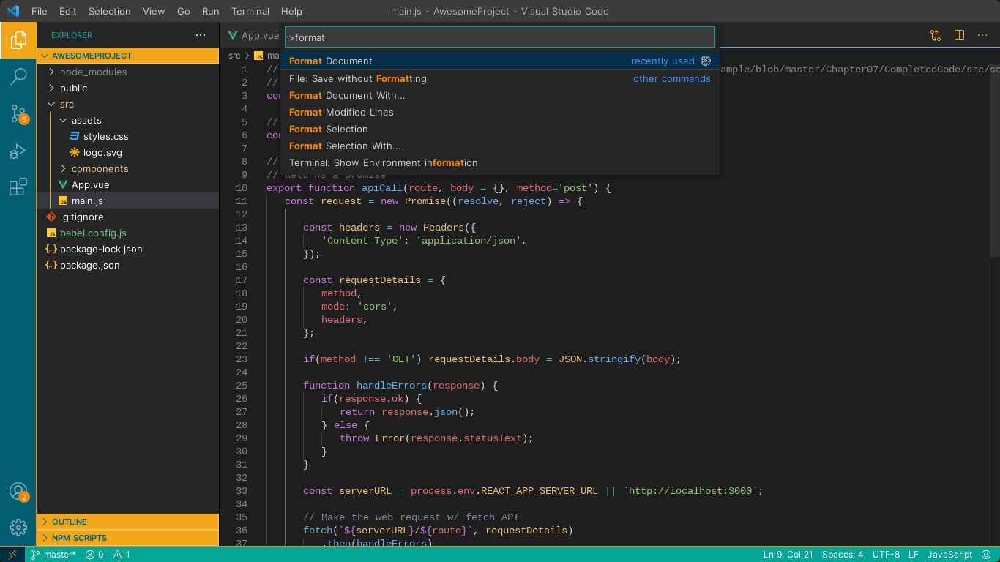
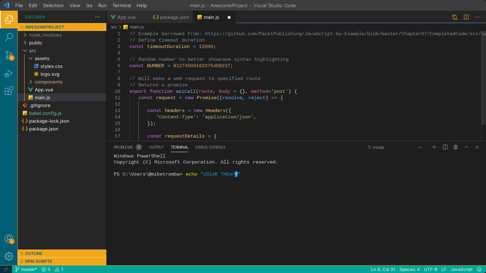

# Prometheus - Visual Extension for Visual Studio Code

## Description

This theme is for the strong, the dedicated, and those who endure the loss of innocence. It is designed to provide a robust development experience. Just as Prometheus delivered fire to humanity, this demi-god speaking to you delivers this theme.

## Features

- **Knowledge and Fire:** The chosen shades of blue for this theme evoke the serenity and depth associated with knowledge. It provides an engaging and focused coding experience. The vibrant yellow brings the fiery energy, innovation, and creative flame that Prometheus boldly shared with us.
- **Advanced Visual Effects:** Blur effects, translucent backgrounds, rounded corners, and enhanced shadows for a modern UI experience (requires setup - see below)

## Installation

1. Install the extension from the [Visual Studio Code Marketplace](https://marketplace.visualstudio.com/items?itemName=KeveenMenezes.prometheus) or via VSIX
2. Select **"Prom-Wiki-2026"** in your theme settings (`Cmd+K Cmd+T`)
3. **For blur/translucency effects:** See [SETUP.md](SETUP.md) for instructions on enabling the advanced CSS features

## Theme in Action

## Contributing

If you encounter issues or have suggestions for improvements, feel free to open an [issue or pull request](https://github.com/KeveenMenezes/Prometheus).

## License

This theme is licensed under the MIT License. Refer to the LICENSE.md file for more details.

---

Enjoy responsibly.
